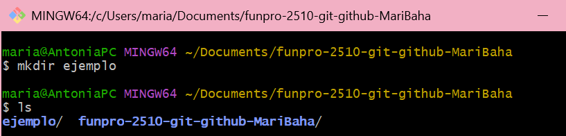
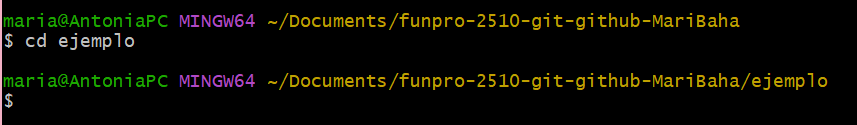
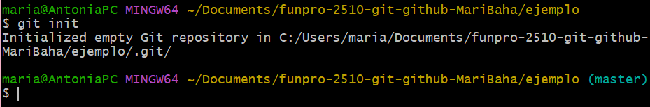
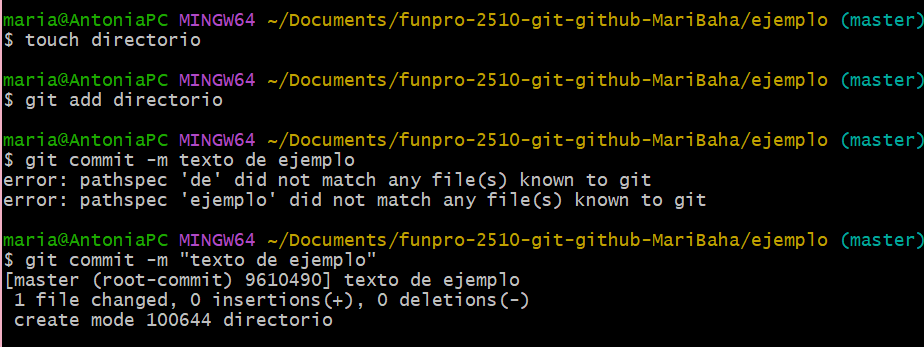
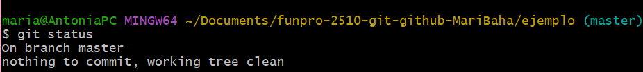

Como crear  un repositorio local con comandos de Git:

1: Empezaremos creando una carpeta con el comando "mkdir" y darle un nombre (sera el nombre del repositorio).

2: Entrar al directorio para que el repositorio se cree dentro.

3: Ejecutamos "git init" y nos tendria que aparecer en verde el nombre de la rama en este caso "Master".

Y ya una vez creado un repositorio, se pueden guardar los cambios usando los comandos "git add" y "git commit". Nota: colocar las comillas al momento de crear un nombre en el commit.

4: Para revisar que todo este bien con nuestro repositorio usamos "git status"

5: Coloca aqui la explicación de git log

