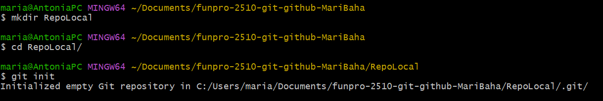
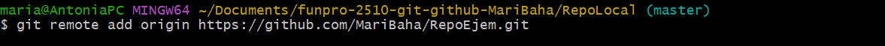
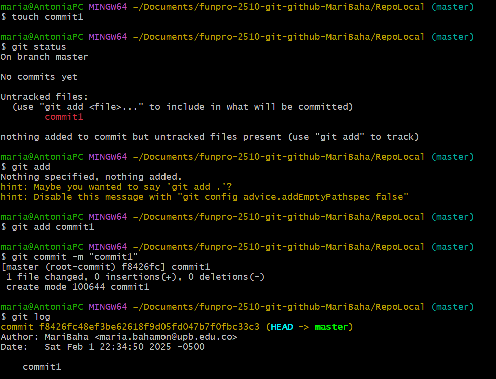
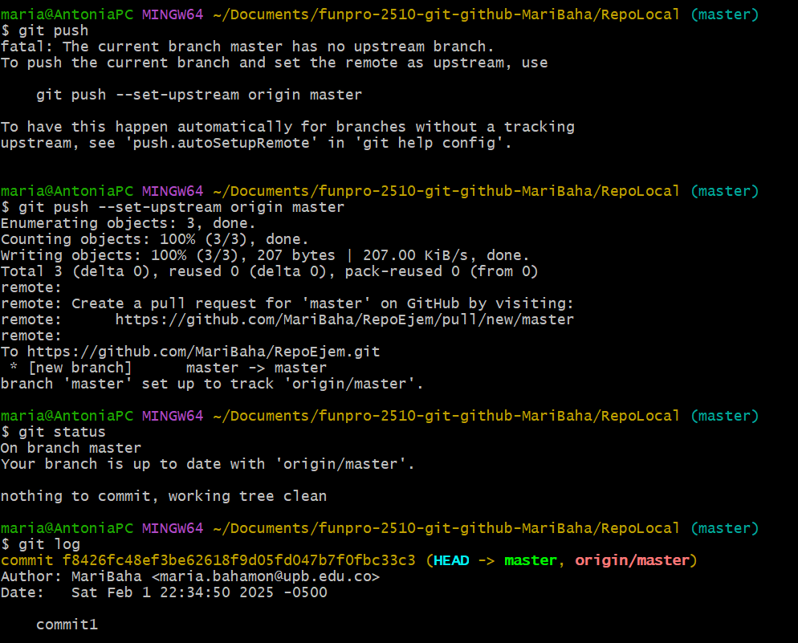

Como crear un repositorio remoto:

1: Vamos a seguir los pasos del tutorial para crear un repositorio local para empezar.

2: Luego procederemos a crear el repositorio en la página de "Github" y usaremos el enlace que se nos da en la pestaña code para enlazar el repositorio con la "nube" (github) usando el comando git remote add origin (enlace del repositorio).

Para revisar esto más a fondo debemos usar el comando git log ya que no se muestra ningún cambio con el comando git status. Para esto primero necesitamos tener listo un commit.

Como podemos ver, solo aparece head y master, ahora debemos usar el comando git push para subir los cambios a la nube y al usar git log vamos a poder ver las ramas de la nube origin/master

Hubo un error debido a que no habiamos configurado la ruta para el push, para solucionarlo usamos el comando que aparece en la consola, una vez hecho el comando el push se realiza automáticamente y podemos ver las ramas con git log.