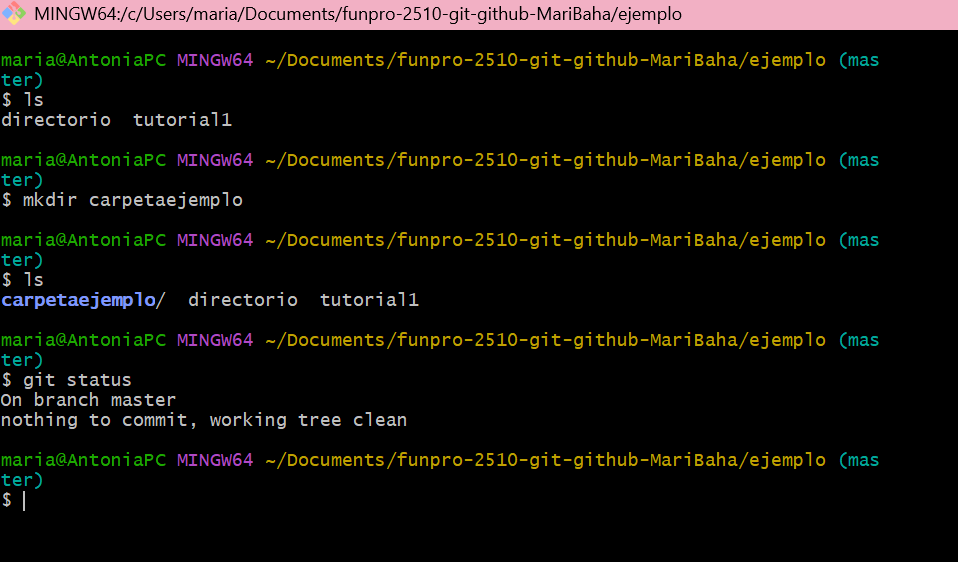
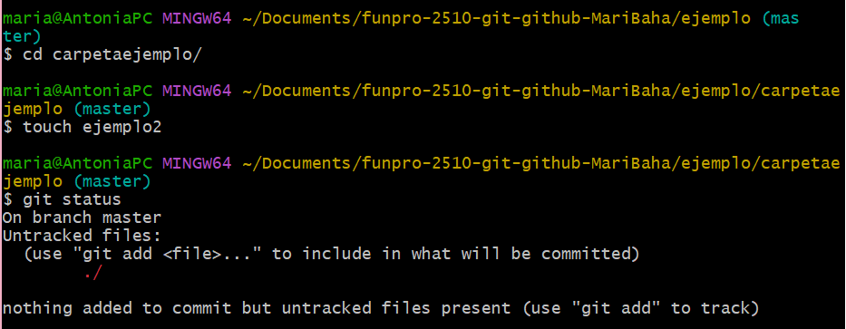
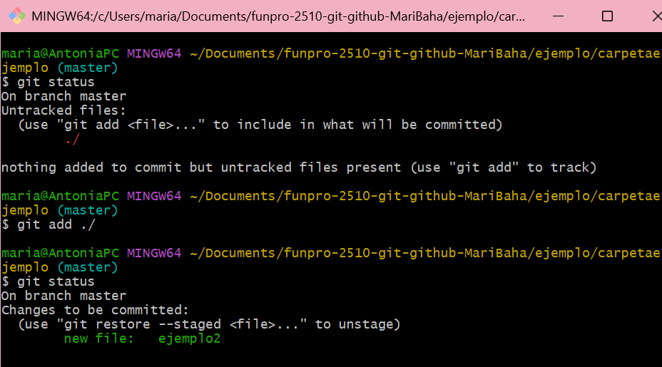
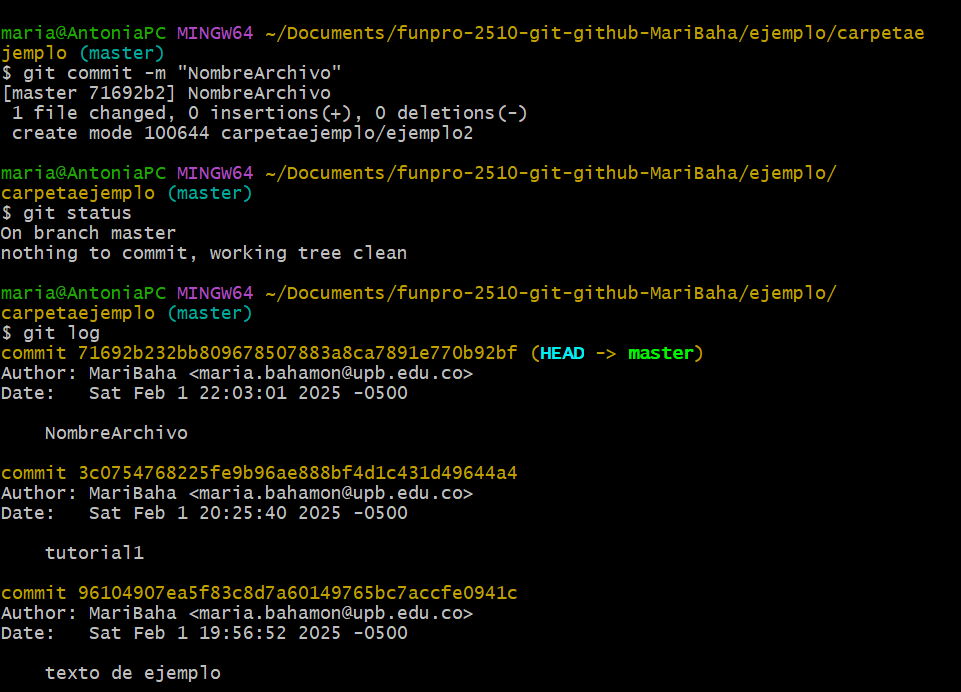

Uso consola, acá podrás ver los diferentes usos de los comandos que hay en git bash 

1: Usamos mkdir para crear carpetas en el directorio en el que nos encontramos actualmente. 

Usamos ls para revisar que la carpeta se haya creado correctamente y git status para saber a que se le debe hacer commit. Nota: Una carpeta no necesita que se le haga commit.

2: Vamos a usar el comando cd para ingresar a la carpeta y ver o modificar su contenido. En este caso usaremos el comando touch para crear un archivo, este cuenta como un cambio y por tanto se le debe hacer commit.

3: Si usamos git status podremos ver el nombre del archivo en rojo, lo que nos indica que hay que subirlo al stage para realizar el commit, para eso usaremos git add, después podremos visualizar el nombre del archivo en verde, eso quiere decir que podemos realizar el commit.

4: Usaremos el comando git commit -m "nombre del comnmit" para guardar los cambios y posteriormente podremos revisarlos con git log, no sin antes revisar el estado del repositorio con git status.
